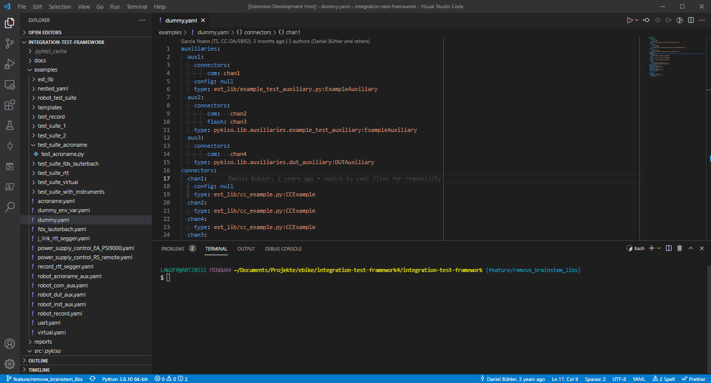

# pykiso-runner

This plugin integrates pykiso into vscode by providing an play button and a context menu entry for yaml files.
Just open a pykiso yaml file and the play button will appear.
It is also able to fix autocompletion in vscode.

## Features

Run an active yaml file.





Run by the context menu

## Requirements

Pykiso needs to be installed on your system. See https://github.com/eclipse-archived/kiso-testing .


## Extension Settings

None

## Known Issues

None

## Release Notes

### 0.1.0

Add real debugging capabilities for ITF

### 0.0.1

Initial release of pykiso runner

## How to get started as a developer

First install nodeJs. https://nodejs.org/en/
From repo root folder install all package dependencies from package.json .

```bash
npm install
npm install -g typescript
```

Open this project and press F5 to run the plugin.

## Create release package

```bash
npm install -g vsce
vsce package --baseContentUrl https://github.com/eclipse/kiso-testing-vscode.git
```
